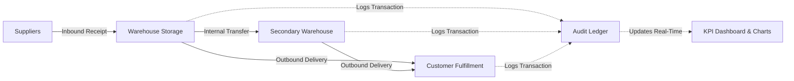

# 📊 SketchStocks

<div align="center">


**A next-generation, glassmorphic real-time inventory and warehouse management platform.**

[](https://github.com/budatisaisrikar/SketchStocks)
[](LICENSE)
[](https://react.dev/)
[](https://www.typescriptlang.org/)
[](https://vite.dev/)
[](https://tailwindcss.com/)
[](https://www.chartjs.org/)

[Features](#-key-features) • [Quick Start](#-quick-start) • [Architecture](#-architecture--tech-stack) • [Workflow](#-operational-workflow) • [Project Structure](#-project-structure) • [Roadmap](#-future-roadmap)

</div>

---

## 🌟 Overview

**SketchStocks** is a high-performance inventory and supply-chain tracking platform engineered with a futuristic, cyber-glass aesthetic. Designed to eliminate operational friction, SketchStocks offers end-to-end visibility into stock levels, multi-warehouse capacity, inbound supplier receipts, outbound customer deliveries, and inter-facility stock transfers.

Whether you run it as a lightweight, zero-dependency standalone web app or as part of a modular React & TypeScript application, SketchStocks delivers instantaneous updates, localized persistence, interactive analytics, and audit logs.

---

## 🚀 Key Features

### 📊 Real-Time Analytics & KPI Dashboard
- **Dynamic KPI Tiles**: Instant metrics for Total Products, Active Warehouses, Completed Inbound Receipts, and Outbound Deliveries.
- **Interactive Stock Trends**: Smooth line graphs visualizing on-hand inventory levels per product powered by Chart.js.
- **Operational Volume Breakdown**: Comparative bar charts tracking inbound intake vs. outbound dispatch volumes.
- **Live Activity Feed**: Immediate chronological audit ticker of all recent inventory movements.

### 📦 Product Catalog Management
- Full lifecycle management (Add, View, Edit, Delete).
- Track essential attributes: Product Name, SKU, Unit of Measure (UOM), Default Warehouse, and Starting Stock.
- Responsive data tables with empty-state indicators and fast inline actions.

### 🏭 Multi-Warehouse Capacity Tracking
- Monitor multiple fulfillment centers, distribution hubs, and warehouses.
- Automatically aggregates storage utilization based on assigned stock.
- Real-time capacity utilization gauges with smart color coding:
  - 🟢 **Normal**: Utilization $\le 70\%$
  - 🟡 **Warning**: Utilization between $70\%$ and $90\%$
  - 🔴 **Critical / Overcapacity**: Utilization $> 90\%$

### 📥 Inbound Receipts (Supplier Operations)
- Generate inbound orders with unique reference tracking (`RCP-XXXXXX`).
- Assign receipts to designated destination warehouses and products.
- Automatically adjusts product stock and commits an immutable entry into the movement ledger.

### 🚚 Outbound Deliveries (Fulfillment)
- Manage customer dispatches with unique tracking keys (`DEL-XXXXXX`).
- Decrement warehouse inventory safely with status monitoring (Pending / Completed).
- Linked directly to audit records for discrepancy prevention.

### 🔄 Inter-Warehouse Transfers
- Transfer inventory between different warehouses without losing tracking accuracy.
- Generates system transfer tags (`TRF-XXXXXX`) and updates source and destination balances simultaneously.

### 📋 Immutable Movement Ledger
- Complete audit trail of every stock change across all facilities.
- Captures transaction reference codes, operation types (Receipt, Delivery, Transfer), product IDs, signed quantities (`+` / `-`), and timestamps.

### 🌐 Cross-Warehouse Stock Matrix
- Comprehensive multi-warehouse breakdown showing exact inventory levels across all physical locations side-by-side with total stock rollups.

### 🔐 User Session & Authentication
- Integrated sign-in / sign-up workflow.
- Generates dynamic user avatar initials and role tags.
- Persistent local session storage with quick logout.

---

## 🛠 Architecture & Tech Stack

```
┌─────────────────────────────────────────────────────────────┐
│                      SketchStocks Client                     │
├──────────────────────────────┬──────────────────────────────┤
│  Core Interface              │  Data & State Layer          │
│  - Glassmorphic Neon CSS     │  - LocalStorage Engine       │
│  - Responsive Modals & Grid  │  - Transaction Ledger Sync   │
│  - Micro-animations (3D CSS) │  - Auto-capacity Aggregation │
├──────────────────────────────┼──────────────────────────────┤
│  Visualizations              │  Ecosystem Foundation        │
│  - Chart.js 3.9              │  - React 19 / TypeScript     │
│  - Interactive Tooltips      │  - Vite Development Server   │
│  - Vector Icons & Badges     │  - Tailwind CSS Engine       │
└──────────────────────────────┴──────────────────────────────┘
```

| Layer | Technologies |
| :--- | :--- |
| **Frontend Framework** | React 19, TypeScript, Vanilla Modern JavaScript (ES6+) |
| **Styling & Theme** | Modern Glassmorphism, Tailwind CSS, Custom CSS Variables |
| **Charts & Metrics** | Chart.js 3.9 (Smooth splines, Bar charts, Responsive canvas) |
| **Icons & Typography** | Inter font family, Lucide React, SVG icon sets |
| **Storage & State** | Client-Side Storage (`localStorage`) with synchronous audit sync |
| **Build Tooling** | Vite 8, PostCSS, Oxlint |

---

## ⚡ Quick Start

### Option 1: Standalone Instant Run (Zero Setup)

You can launch the complete application immediately without installing Node.js or external servers:

1. Clone or download the repository:
   ```bash
   git clone https://github.com/budatisaisrikar/SketchStocks.git
   cd SketchStocks
   ```
2. Open `sketchstocks-final.html` in any modern web browser (Chrome, Safari, Edge, Firefox):
   - **macOS**: `open sketchstocks-final.html`
   - **Linux**: `xdg-open sketchstocks-final.html`
   - **Windows**: `start sketchstocks-final.html`

---

### Option 2: Full Vite + React Development Environment

For developers building upon the React & TypeScript components:

1. **Clone the repository**:
   ```bash
   git clone https://github.com/budatisaisrikar/SketchStocks.git
   cd SketchStocks
   ```

2. **Install dependencies**:
   ```bash
   npm install
   ```

3. **Start the local development server**:
   ```bash
   npm run dev
   ```
   Open [http://localhost:5173](http://localhost:5173) in your browser.

4. **Build for production**:
   ```bash
   npm run build
   ```

5. **Run the linter**:
   ```bash
   npm run lint
   ```

---

## 🔄 Operational Workflow



1. **Receive Goods**: Create a **Receipt** specifying the supplier, product, destination warehouse, and quantity. Stock increments instantly.
2. **Transfer Stock**: Rebalance inventory using **Transfers** between branches or warehouse bins.
3. **Dispatch Orders**: Create a **Delivery** referencing the customer order. Stock is deducted and capacity freed up.
4. **Audit & Reconcile**: Review the **Move History** or inspect the **Stock by Warehouse** matrix to ensure inventory accuracy.

---

## 📁 Project Structure

```text
SketchStocks/
├── sketchstocks-final.html   # Complete standalone app (UI, styles, logic, Chart.js)
├── index.html                # Vite entry point
├── package.json              # Project dependencies & scripts
├── package-lock.json         # Pinned dependency versions
├── vite.config.ts            # Vite build and plugin configurations
├── tsconfig.json             # Root TypeScript project config
├── tsconfig.app.json         # Application TypeScript config
├── tsconfig.node.json        # Vite Node TypeScript config
├── tailwind.config.js        # Tailwind CSS design system theme settings
├── postcss.config.js         # PostCSS plugins configuration
├── .oxlintrc.json            # Fast Oxlint configuration
├── public/
│   ├── favicon.svg           # Application favicon
│   └── icons.svg             # SVG icon definitions
└── src/
    ├── main.tsx              # React mounting root
    ├── App.tsx               # Main application component
    ├── App.css               # Component-level styling
    ├── index.css             # Global base stylesheet & CSS variables
    └── assets/               # Branding assets & logos
```

---

## 🎨 Theme Customization

SketchStocks features an accessible, high-contrast dark theme. Colors are mapped through CSS custom properties and can be customized in `:root`:

```css
:root {
    --bg-primary: #0a0e27;      /* Primary dark canvas */
    --bg-secondary: #141f3d;    /* Card and sidebar background */
    --accent: #00d4ff;          /* Cyber cyan accent */
    --accent-light: #00e5ff;    /* Glowing cyan highlight */
    --success: #10b981;         /* Positive indicator */
    --warning: #f59e0b;         /* Cautionary threshold indicator */
    --danger: #ef4444;          /* Critical capacity alert */
}
```

---

## 🗺 Future Roadmap

- [ ] **Cloud Backend Integration**: Optional sync with PostgreSQL / Supabase / Firebase.
- [ ] **Barcode & QR Code Scanning**: Camera-based SKU scanning for receipt and delivery processing.
- [ ] **Low-Stock Automatic Alerts**: Email/browser notifications when safety stock thresholds are breached.
- [ ] **Export & Reporting**: PDF invoice and CSV/Excel ledger exports.
- [ ] **Role-Based Access Control (RBAC)**: Administrator, Warehouse Manager, and Auditor permissions.

---

## 🤝 Contributing

Contributions are what make the open-source community an amazing place to learn, inspire, and create. Any contributions you make are **greatly appreciated**!

1. Fork the Project
2. Create your Feature Branch (`git checkout -b feature/AmazingFeature`)
3. Commit your Changes (`git commit -m 'Add some AmazingFeature'`)
4. Push to the Branch (`git push origin feature/AmazingFeature`)
5. Open a Pull Request

---

## 📄 License

Distributed under the **MIT License**. See `LICENSE` for more information.

---

## 👤 Author

Developed with care by **[budatisaisrikar](https://github.com/budatisaisrikar)**.  
Project Repository: [https://github.com/budatisaisrikar/SketchStocks](https://github.com/budatisaisrikar/SketchStocks)
